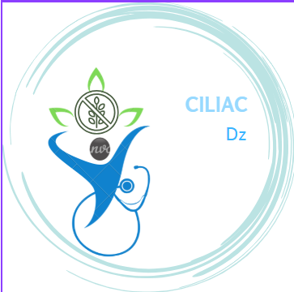
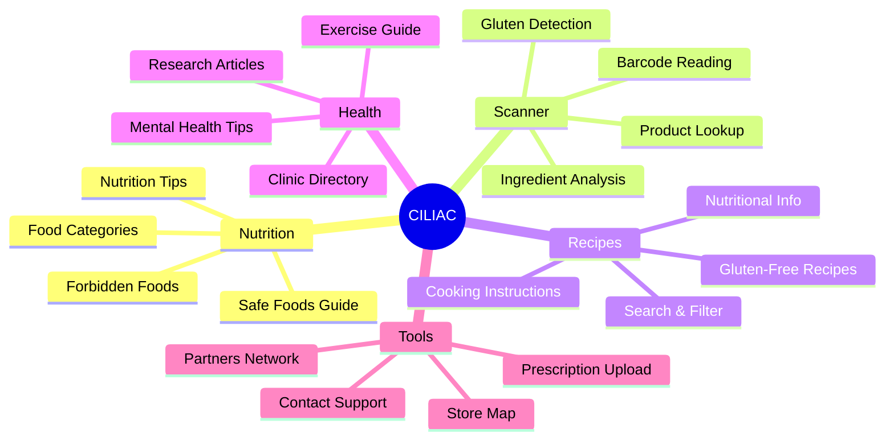
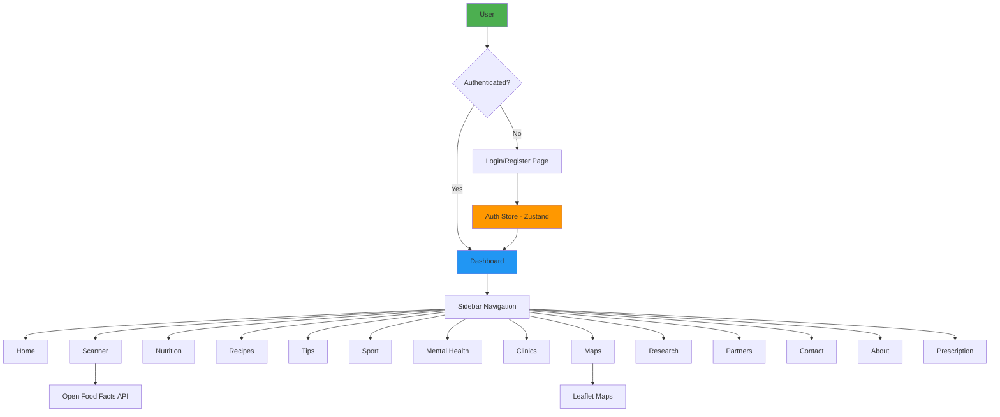
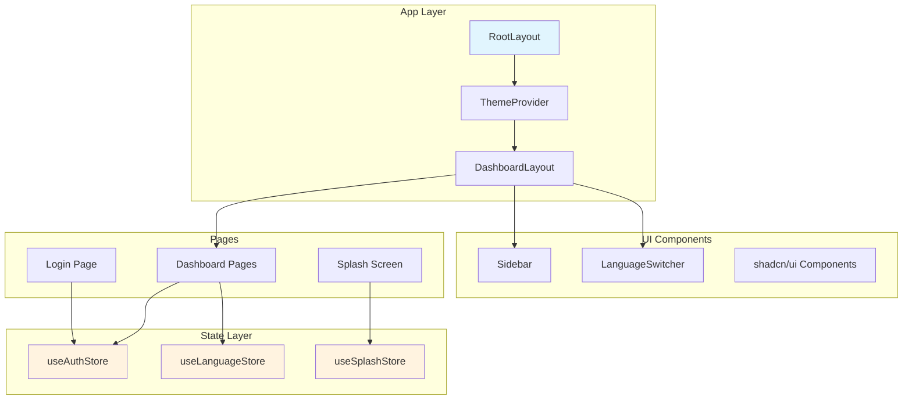
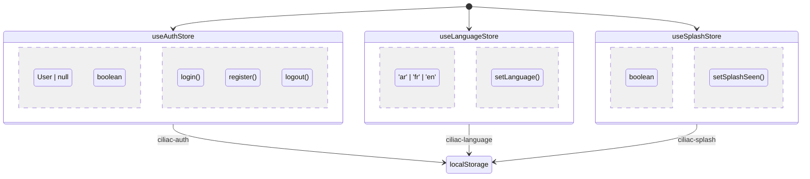
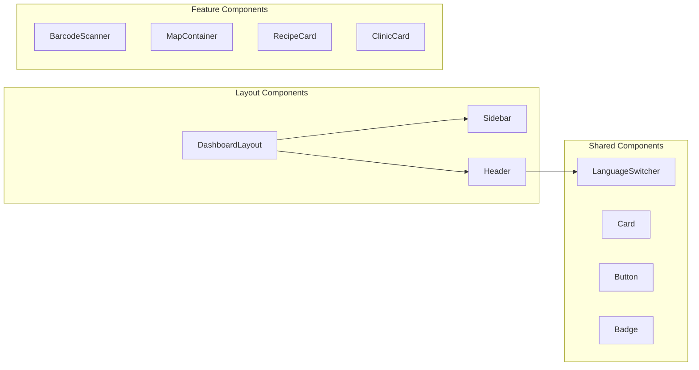
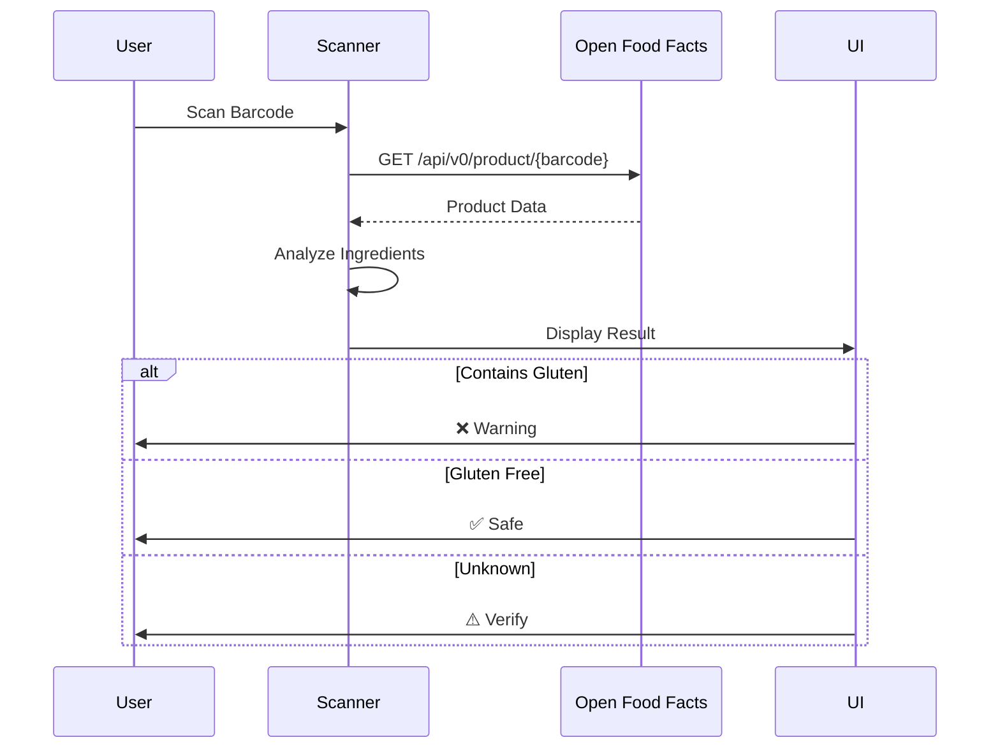

# 🌾 CILIAC - Celiac Disease Management Platform

<div align="center">



**Your comprehensive guide for a healthy and happy gluten-free life**

[](https://nextjs.org/)
[](https://reactjs.org/)
[](https://www.typescriptlang.org/)
[](https://tailwindcss.com/)
[](https://zustand-demo.pmnd.rs/)

[🇩🇿 العربية](#arabic) | [🇫🇷 Français](#french) | [🇬🇧 English](#english)

</div>

---

## 📋 Table of Contents

- [Overview](#-overview)
- [Features](#-features)
- [Architecture](#-architecture)
- [Tech Stack](#-tech-stack)
- [Installation](#-installation)
- [Project Structure](#-project-structure)
- [State Management](#-state-management)
- [Pages & Components](#-pages--components)
- [Internationalization](#-internationalization)
- [API Integration](#-api-integration)
- [Contributing](#-contributing)
- [License](#-license)

---

## 🎯 Overview

CILIAC is a comprehensive web application designed to help people with celiac disease manage their daily lives. The platform provides:

- 📱 Barcode scanner to verify gluten-free products
- 🗺️ Interactive map of gluten-free stores in Algeria
- 📖 Extensive recipe collection
- 🏥 Directory of specialized clinics
- 📚 Scientific research and articles
- 💊 Prescription upload and analysis
- 🌐 Multi-language support (Arabic, French, English)

---

## ✨ Features

### Core Features



### Feature Highlights

| Feature                    | Description                                                                        |
| -------------------------- | ---------------------------------------------------------------------------------- |
| 🔍 **Barcode Scanner**     | Scan products and instantly check if they contain gluten using Open Food Facts API |
| 🗺️ **Interactive Map**     | Find 16+ gluten-free stores, bakeries, and restaurants across Algeria              |
| 🍳 **Recipe Library**      | 150+ gluten-free recipes with detailed instructions and nutritional information    |
| 🏥 **Clinic Directory**    | List of 8+ specialized clinics and doctors in Algeria                              |
| 📄 **Prescription Upload** | Upload medical prescriptions to check medications for gluten                       |
| 🌐 **Multi-language**      | Full support for Arabic (RTL), French, and English                                 |

---

## 🏗️ Architecture

### Application Flow



### Component Architecture



---

## 🛠️ Tech Stack

### Frontend Framework

- **Next.js 16.1.6** - React framework with App Router and Turbopack
- **React 19.2.3** - UI library
- **TypeScript** - Type safety

### Styling

- **Tailwind CSS 4.x** - Utility-first CSS
- **shadcn/ui** - Accessible component library
- **Framer Motion** - Animations

### State Management

- **Zustand 5.x** - Lightweight state management with persistence

### Maps & Scanning

- **React-Leaflet** - Interactive maps
- **Open Food Facts API** - Product data

### Development Tools

- **ESLint** - Code linting
- **Turbopack** - Fast bundler

---

## 🚀 Installation

### Prerequisites

- Node.js 18+
- npm or yarn

### Setup

```bash
# Clone the repository
git clone https://github.com/yourusername/ciliac-pro.git
cd ciliac-pro

# Install dependencies
npm install

# Run development server
npm run dev

# Build for production
npm run build

# Start production server
npm start
```

### Environment Variables

Create a `.env.local` file:

```env
# No external API keys required - uses public APIs
NEXT_PUBLIC_APP_URL=http://localhost:3000
```

---

## 📁 Project Structure

```
ciliac-pro/
├── public/
│   ├── Logo.png              # App logo
│   └── favicon.ico           # Favicon
├── src/
│   ├── app/
│   │   ├── dashboard/
│   │   │   ├── page.tsx      # Home dashboard
│   │   │   ├── layout.tsx    # Dashboard layout with sidebar
│   │   │   ├── about/        # About page
│   │   │   ├── clinics/      # Clinics directory
│   │   │   ├── contact/      # Contact form
│   │   │   ├── maps/         # Interactive map
│   │   │   ├── mental/       # Mental health
│   │   │   ├── nutrition/    # Nutrition guide
│   │   │   ├── partners/     # Partners list
│   │   │   ├── prescription/ # Prescription upload
│   │   │   ├── recipes/      # Recipe library
│   │   │   ├── research/     # Research articles
│   │   │   ├── scanner/      # Barcode scanner
│   │   │   ├── sport/        # Exercise guide
│   │   │   └── tips/         # Tips & guidelines
│   │   ├── login/
│   │   │   └── page.tsx      # Login/Register page
│   │   ├── layout.tsx        # Root layout
│   │   ├── page.tsx          # Landing/Splash page
│   │   └── globals.css       # Global styles
│   ├── components/
│   │   ├── ui/               # shadcn/ui components
│   │   ├── splash/           # Splash screen
│   │   └── LanguageSwitcher.tsx
│   └── lib/
│       ├── store.ts          # Zustand stores
│       ├── translations.ts   # i18n translations
│       └── utils.ts          # Utility functions
├── package.json
├── next.config.ts
├── tailwind.config.ts
└── tsconfig.json
```

---

## 🔄 State Management

CILIAC uses **Zustand** for state management with persistence middleware.

### Store Architecture



### Store Implementation

```typescript
// Auth Store
export const useAuthStore = create<AuthState>()(
  persist(
    (set) => ({
      user: null,
      isAuthenticated: false,
      login: async (email, password) => {
        /* ... */
      },
      register: async (name, email, password) => {
        /* ... */
      },
      logout: () => set({ user: null, isAuthenticated: false }),
    }),
    { name: "ciliac-auth" },
  ),
);

// Language Store
export const useLanguageStore = create<LanguageState>()(
  persist(
    (set) => ({
      language: "ar",
      setLanguage: (lang) => set({ language: lang }),
    }),
    { name: "ciliac-language" },
  ),
);
```

---

## 📄 Pages & Components

### Page Overview

| Page         | Route                     | Description                               |
| ------------ | ------------------------- | ----------------------------------------- |
| Home         | `/dashboard`              | Main dashboard with stats and quick links |
| Scanner      | `/dashboard/scanner`      | Barcode scanner with camera access        |
| Prescription | `/dashboard/prescription` | Upload medical prescriptions              |
| Nutrition    | `/dashboard/nutrition`    | Safe/unsafe foods guide                   |
| Recipes      | `/dashboard/recipes`      | Gluten-free recipe library                |
| Tips         | `/dashboard/tips`         | Practical living tips                     |
| Sport        | `/dashboard/sport`        | Exercise recommendations                  |
| Mental       | `/dashboard/mental`       | Mental health support                     |
| Clinics      | `/dashboard/clinics`      | Specialist directory                      |
| Maps         | `/dashboard/maps`         | Interactive store map                     |
| Research     | `/dashboard/research`     | Scientific articles                       |
| Partners     | `/dashboard/partners`     | Partner businesses                        |
| Contact      | `/dashboard/contact`      | Contact form                              |
| About        | `/dashboard/about`        | App information                           |
| Login        | `/login`                  | Authentication                            |

### Key Components



---

## 🌐 Internationalization

### Supported Languages

| Code | Language          | Direction |
| ---- | ----------------- | --------- |
| `ar` | العربية (Arabic)  | RTL       |
| `fr` | Français (French) | LTR       |
| `en` | English           | LTR       |

### Translation Structure

```typescript
// src/lib/translations.ts
export const translations = {
  common: { ar: {...}, fr: {...}, en: {...} },
  nav: { ar: {...}, fr: {...}, en: {...} },
  dashboard: { ar: {...}, fr: {...}, en: {...} },
  nutrition: { ar: {...}, fr: {...}, en: {...} },
  recipes: { ar: {...}, fr: {...}, en: {...} },
  // ... more sections
}
```

### Usage in Components

```tsx
import { useLanguageStore } from "@/lib/store";
import { translations } from "@/lib/translations";

function MyComponent() {
  const { language } = useLanguageStore();
  const t = translations.mySection[language];
  const isRtl = language === "ar";

  return (
    <div dir={isRtl ? "rtl" : "ltr"}>
      <h1>{t.title}</h1>
    </div>
  );
}
```

---

## 🔌 API Integration

### Open Food Facts API

Used for barcode scanning and product lookup:

```typescript
const fetchProductData = async (barcode: string) => {
  const response = await fetch(
    `https://world.openfoodfacts.org/api/v0/product/${barcode}.json`,
  );
  const data = await response.json();
  // Analyze for gluten content
};
```

### Response Processing



---

## 🤝 Contributing

We welcome contributions! Please follow these steps:

1. Fork the repository
2. Create a feature branch (`git checkout -b feature/amazing-feature`)
3. Commit your changes (`git commit -m 'Add amazing feature'`)
4. Push to the branch (`git push origin feature/amazing-feature`)
5. Open a Pull Request

### Development Guidelines

- Follow TypeScript best practices
- Use Conventional Commits
- Write meaningful component documentation
- Ensure RTL support for new features
- Add translations for all supported languages

---

## 📜 License

This project is licensed under the MIT License - see the [LICENSE](LICENSE) file for details.

---

## 👥 Team

- **Development Team** - Application development
- **Medical Advisors** - Content review
- **Nutritionists** - Recipe development
- **Celiac Community** - User feedback and testing

---

## 📞 Contact

- **WhatsApp**: +213 783 32 13 19
- **Email**: contact@ciliac-dz.com
- **Location**: Algiers, Algeria

---

<div align="center">

**Made with ❤️ for the Celiac Community in Algeria**

🌾 CILIAC - Living Gluten-Free, Living Better 🌾

</div>
